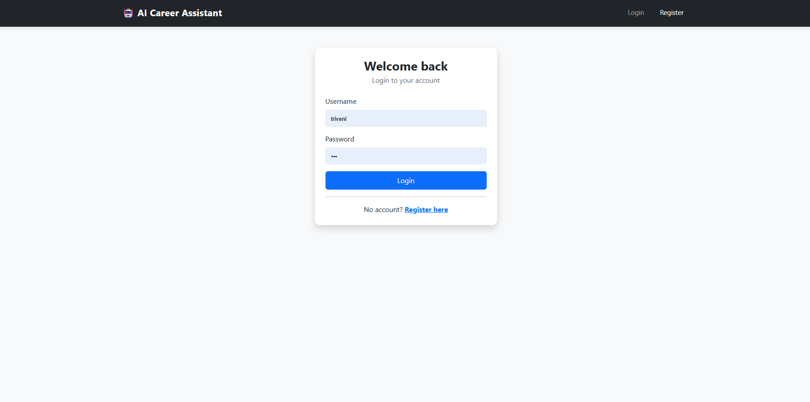
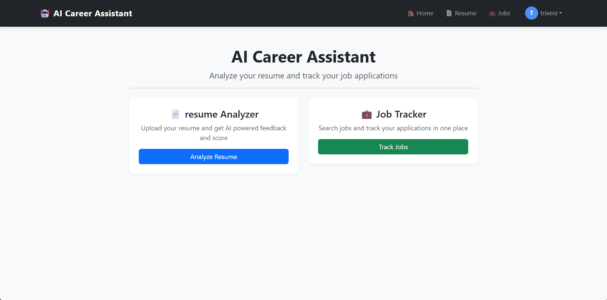
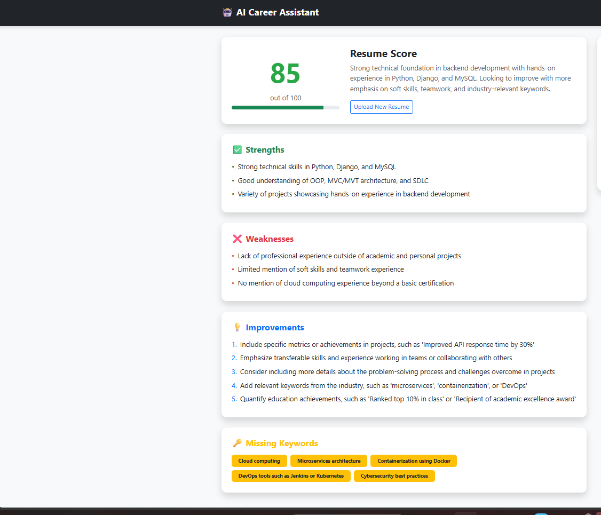
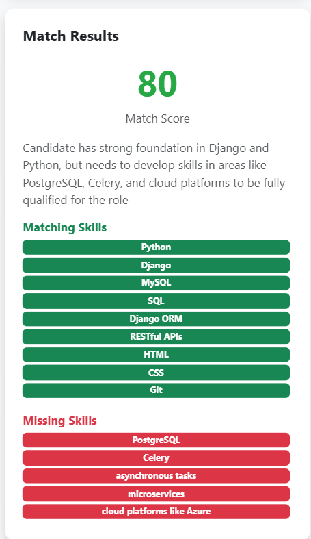
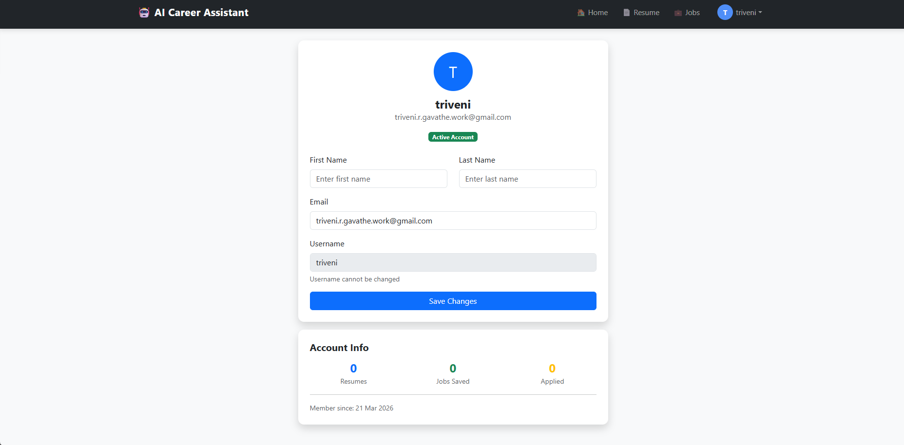
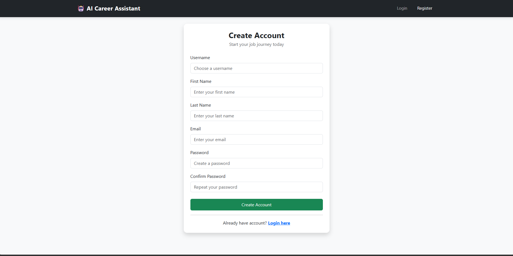

# 🤖 AI Career Assistant

**Analyze resumes and track job applications — all in one place**


</div>

---

## 📌 About The Project

AI Career Assistant is a Django-based web application that helps users:

* 📄 Analyze resumes with structured, API-assisted feedback
* 💼 Track and manage job applications efficiently

This project focuses on **practical automation and real-world usability** rather than complex ML models.

---

## ✨ Features

### 📄 Resume Analyzer

* Upload PDF resume
* Extract text using PyPDF2
* Generate resume score (0–100)
* Identify strengths & weaknesses
* Detect missing keywords
* Match resume with job description
* Provide improvement suggestions

---

### 💼 Job Tracker 🚧 (In Progress)

* Search jobs from multiple platforms
* Save jobs to personal dashboard
* Track application stages:

  * Saved → Applied → Interview → Offer
* Add notes for each job
* View application insights

---

## 🔄 Workflow

1. Upload resume (PDF)
2. Extract text from file
3. Provide job description
4. Process using rule-based + API-assisted logic
5. Display:

   * Match score
   * Missing skills
   * Suggestions

---

## 🛠️ Tech Stack

| Category        | Technology              |
| --------------- | ----------------------- |
| Backend         | Python, Django          |
| API Integration | Groq API                |
| PDF Processing  | PyPDF2                  |
| Database        | SQLite                  |
| Frontend        | HTML, CSS, Bootstrap    |
| Email           | Gmail SMTP              |
| Scraping        | BeautifulSoup, Requests |

---

## 📂 Project Structure

```
ai-career-assistant/
│
├── core/                # Django project settings
├── resumeAnalyzer/      # Resume analysis module
├── job_tracker/         # Job tracking module
├── templates/           # HTML templates
├── static/              # CSS and JS files
├── media/               # Uploaded resumes
├── requirements.txt
└── manage.py
```

---

## 📸 Screenshots

---

### 🟢 1. Login / Authentication Page
> Secure user login and signup system with validation.



---

### 🏠 2. Home / Dashboard
> Overview of user activity and main features.



---

### 📊 3. Feature Pages / Scoring System
> Core functionality showing resume analysis and GD matching.

**Resume Score**


**GD Match Score**


---

### 👤 4. Profile Page
> User profile details and personalized insights.



---

### 📝 5. Register Page
> New user registration with validation and secure signup flow.



---

## 🚀 Getting Started

```bash
git clone https://github.com/your-username/ai-career-assistant.git
cd ai-career-assistant

python -m venv venv
venv\Scripts\activate

pip install -r requirements.txt

python manage.py migrate
python manage.py runserver
```

Open:

```
http://127.0.0.1:8000
```

---

## 🔑 Environment Variables

Create a `.env` file:

```
GROQ_API_KEY=your_api_key
EMAIL_USER=your_email@gmail.com
EMAIL_PASS=your_app_password
```

---

## ⚠️ Limitations

* No custom ML model (API-based analysis only)
* Output depends on resume quality
* Job tracker is still under development

---

## 🗺️ Roadmap

* [x] Resume analysis
* [x] Job matching
* [ ] Job tracker
* [ ] Email alerts
* [ ] Deployment

---

## 👩‍💻 Author

**Triveni Gavathe**

* LinkedIn:https://www.linkedin.com/in/triveni-gavathe-/
* GitHub: https://github.com/triveni-gavathe
* Email: [triveni.r.gavathe.work@gmail.com](mailto:triveni.r.gavathe.work@gmail.com)

---

## 📝 License

MIT License

---

⭐ If you found this project useful, consider giving it a star!
